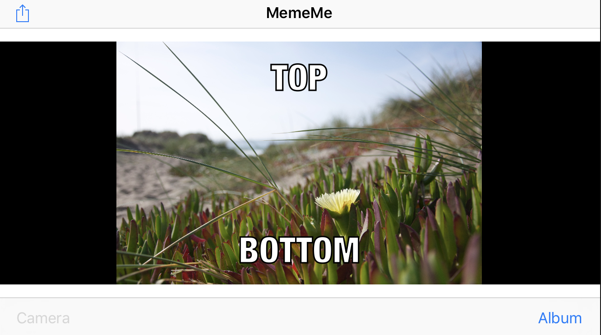

# MemeMe-V1
IOS app that creates Mems from photo libarary or camera and enable the user to share it. Udacity project

## How to run
* Download or clone repo 
* open MemeMe V1.xcodeproj file
* run

## Screen Shots

